# Objetivos

Criar uma Virtual Machine EC2 na AWS e acessar via SSH.

# Materiais

- EC2
- SSH

# Método

Utilizaremos o learner lab para ter acesso ao terminal da AWS, iniciaremos uma instância EC2 Linux, criaremos uma chave SSH e conectaremos ela por meio do CMD ao nosso EC2, após isso basta nos conectarmos a instância. 

# Resultado

### PASSO 1

Abra o *Learner Lab* da AWS e inicialize o LAB.

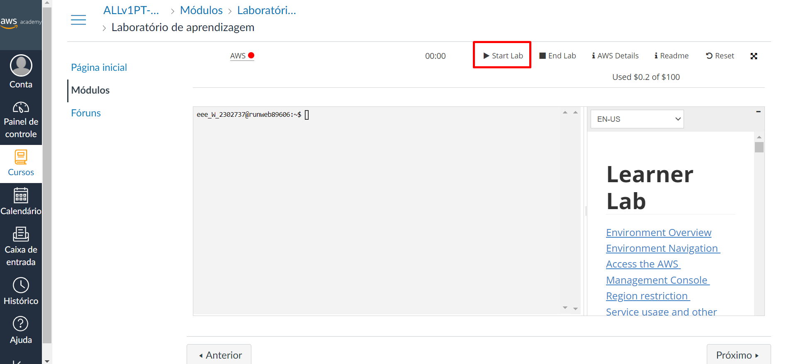

Quando o LAB for inicializado completamente, ele ficará com o ponto verde acesso. Após notar essa mudança, clique em "AWS" 

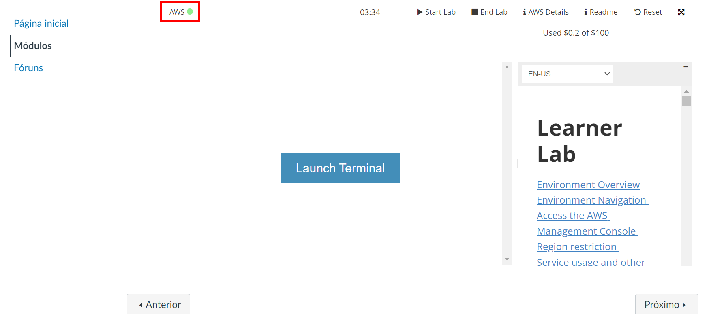

### PASSO 2

Ao entrar na plataforma da AWS, vá até o campo de pesquisa, procure por EC2 e clique na opção destacada na imagem abaixo 

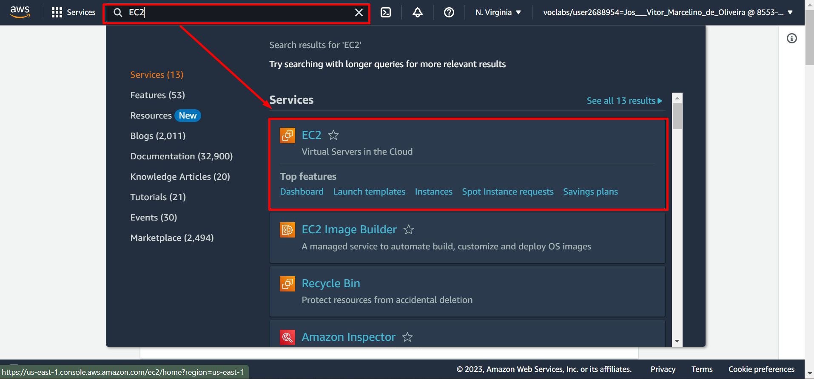

### PASSO 4

Vá até *Instances* e clique em *Launch Instance* para criar uma nova instância.

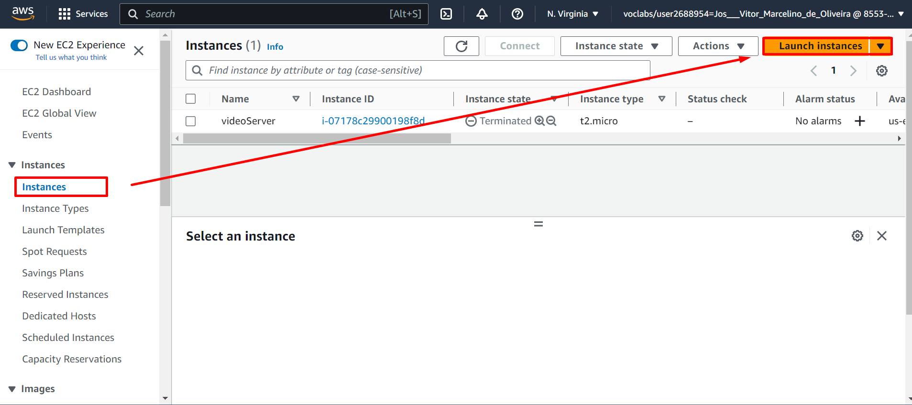

### PASSO 5

Configure sua máquina virtual conforme seus interesses

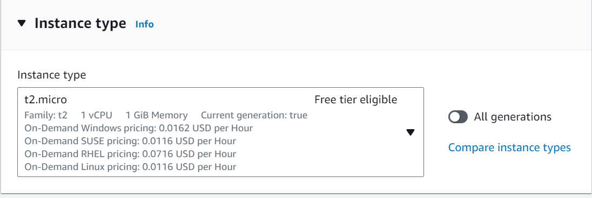

### PASSO 6

Ainda no menu de configuração da instância EC2, crie uma *Key Pair*.

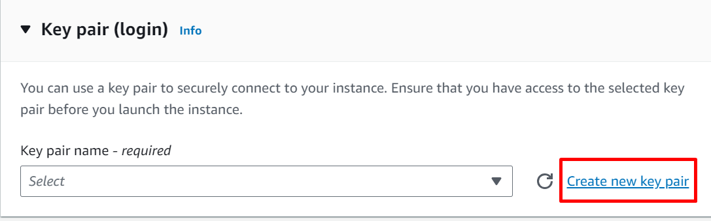

Configure-a

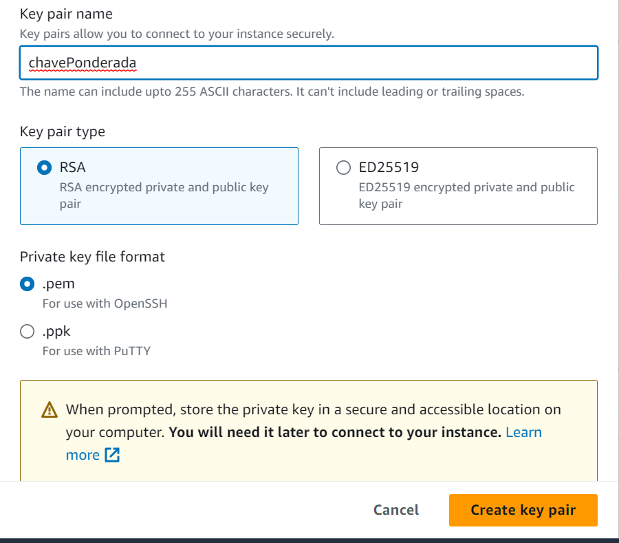

### PASSO 7

Agora finalize a criação da sua instância (é possível ver um resumo das configurações da sua instância).

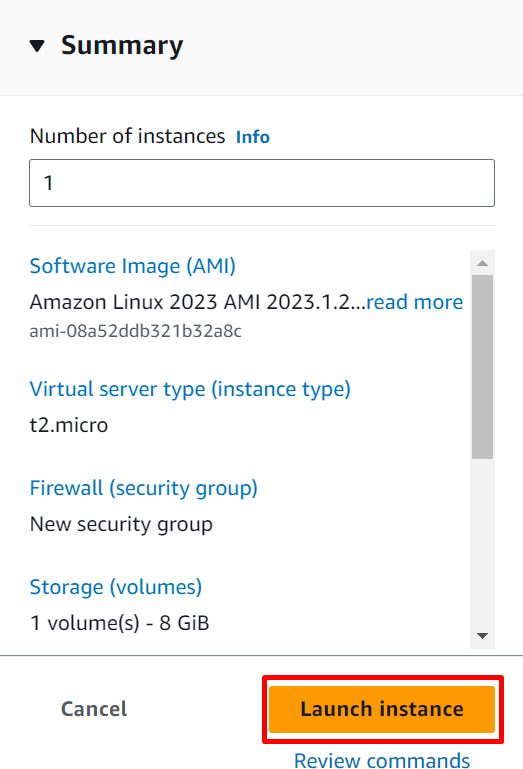

### PASSO 8

Volte para a aba de *Instances*, selecione a instância récem-criada e clique em *Connect*.

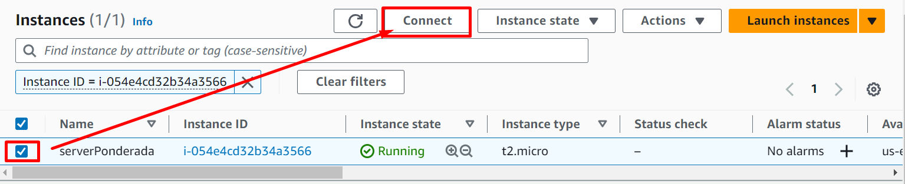

### PASSO 9

Agora, vamos acessar nossa VM por meio do SSH. Selecione a opção SSH client e copie o código que aparecerá para você no campo destacado. 

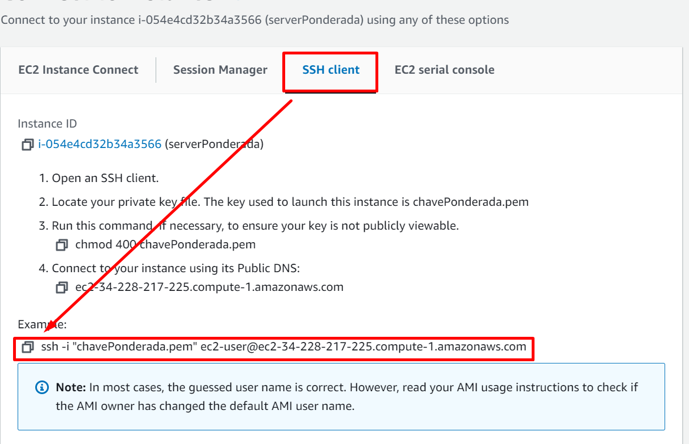

### PASSO 10

Abra o Prompt de comando ou PowerShell.
Vá até o diretório onde sua chave ssh foi criada, cole o código copiado no passo anterior. Digite *yes* para continuar a conexão.

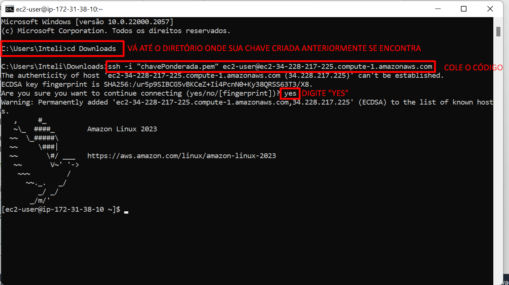

### PASSO 11

Agora estamos conectados ao nosso EC2 por meio do terminal.

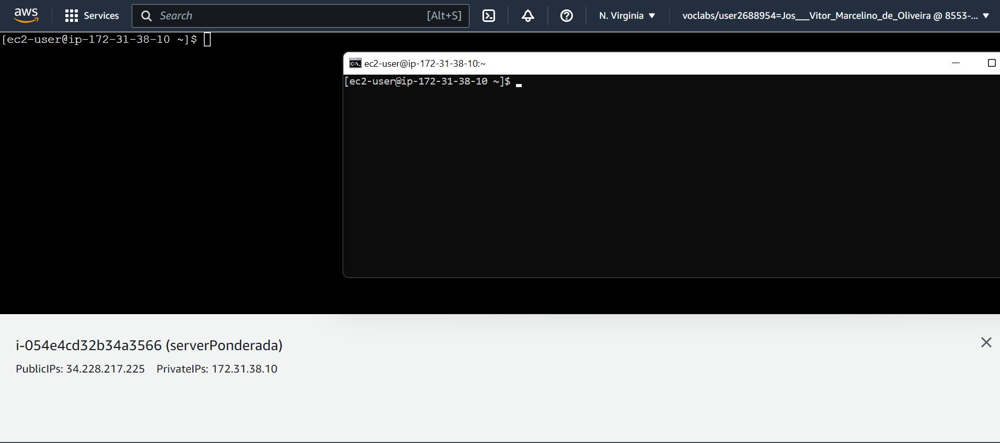

# Conclusão

Percebi que essa criação de EC2 é o praticamente o início de tudo para computação em cloud. É interessante aprender a iniciar instâncias porque essa é uma função crucial para entender como colocar uma aplicação na nuvem.